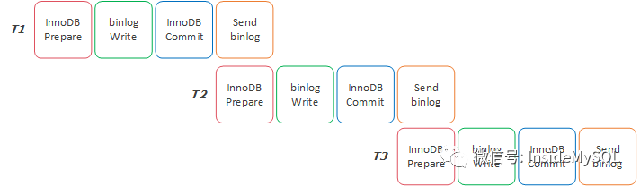

after_sync vs after_commit，哪个性能更好？ 

<u>来源：破产码农</u>

虽然区区早早认定MGR会成为MySQL高可用的标准（见：[1] ; [2] ），甚至可以比肩乃至超越经典的Oracle RAC架构，然而不得不承认，MySQL半同步复制依然是高可用的主流设计架构。

MySQL 5.7推出了Loss-less Semi-Synchronous Replication，也就是常说的无损复制，即MySQL能原生保障主从服务器数据的一致性与安全性。

对于无损复制的配置，将参数rpl_semi_sync_master_wait_point设置为after_sync即可，而之前MySQL 5.5、5.6半同步的复制模式为after_commit。

为什么5.7版本之前的after_commit半同步模式不是无损复制呢？因为其在主从切换过程中存在幻读问题（非数据库理论的幻读）。即切换过后，之前用户“看到”的数据可能不存在了。原理不再赘述，一句话总结：after_commit在主机事务提交后将日志传送到从机，after_sync是先传再提交。

图1 after_sync vs after_commit

综上所述，核心金融级MySQL数据库强烈建议采用after_sync的无损复制模式，after_commit有欠严谨性，特别是对于姜老师这种玄门正宗的数据库门派出身的开发人员。

不过，今天姜老师想要阐述的问题不是该不该使用after_sync的无损复制模式，因为99.999%的场景应该使用，特别是对于数据一致性要求极其严格的核心金融系统。

因此，今天姜老师的问题可能有些无聊，问题是：after_sync vs after_commit，哪个性能更好？肯定有同学会问，不是前面说没必要讨论嘛，肯定要用after_sync。然而，无聊问题的背后折射了一些更为深层次的业务架构考虑。

看到过有类似的公号文章分析过，但说得难听点，还是单细胞思考模式，因为姜老师强调过无数次，任何事物不是线性的，而是x + y = 1的模型。即，无限种可能性。对于after_sync vs after_commit，有下面三种可能性：

1. after_sync性能好 

2. after_commit性能好 

3. 没区别。
   
   这是大千世界的极美妙之处，AI无法取代人类之光。AI无法计算无穷种可能性，AI只通过各种算法计算概率，无法穷举出x + y = 1的所有结果。

从上面的图1可以看到，一个事务在半同步模式下提交，无论是after_sync还是after_commit，都要经历4个阶段：

1. InnoDB Redo File Write

2. binlog File Flush & Sync

3. InnoDB Redo File Commit（同时释放事务持有的锁）

4. Send binlog to Slave

after_sync模式下，4个阶段的顺序为1->2->4->3，after_commit模式为1->2->3->4。这个顺序也解释了为什么after_commit为什么会有“幻读”问题。

现在假设阶段1、2、3各需要1ms时间，阶段4需要0.2ms时间，那么一次事务提交的时间：

T after_sync = 1 + 1 + 0.2 + 1 = 3.2 ms

T after_commit = 1 + 1 + 0.2 + 1 = 3.2 ms

这不是没有区别嘛。的确，没有任何区别。但是，让我们来拉长时间，观察一个线程下，多个事务连续提交所需要的时间：

T after_sync（1） = 1 + 1 + 0.2 + 1 = 3.2 ms

T after_sync （2）= 1 + 1 + 0.2 + 1 = 3.2 ms

T after_sync （3）= 1 + 1 + 0.2 + 1 = 3.2 ms

上面是在after_sync无损复制模式下，连续提交3个事务所需要的时间。没有任何区别。然而在after_commit模式下：

T after_commit（1） = 1 + 1 + 0.2 + 1 = 3.2 ms

T after_commit （2）= 1 + 1 + 0.2 + 1 - 0.2 = 3 ms

T after_commit （3）= 1 + 1 + 0.2 + 1 - 0.2 = 3 ms

然而在after_commit模式下，事务提交所需要的时间发生了变化，即从第二个事务开始，after_commit的事务所需的时间都减少为了3ms。这是因为after_commit模式下在第一个事务等待传送日志的时候，后面的事务就可以进行提交了。

若还不明白，下面的图2和图3可能更为直观一些：

图2 after_sync的事务T1~T3的耗时

由于after_commit先提交事务，因此整个过程变为:

图3 after_commit的事务T1~T3的耗时

其实after_commit模式一个事务的执行时间还是3.2ms，但是他提前执行了0.2ms，即事务T1、T2、T3之间有重叠执行的时间段，因此事务T2、T3的实际执行时间“缩短”为了3ms。

前面假设Send binlog to Slave的时间为0.2ms，这是因为我们假设半同步从机是同机房从机，两台服务器的延迟为0.2ms。若这时半同步复制为同城跨IDC复制，则耗时变为3ms，则这时两种模式的性能差距变为了：

T after_sync = 1 + 1 + 3 + 1 = 6 ms

T after_commit = 1 + 1 + 3 + 1 - 3 = 3 ms

在上述条件下，两种模式的性能理论差距可以达到1倍。若这时进行跨城30ms延迟的半同步复制呢？after_sync简直惨不忍睹......

感觉after_sync性能被after_commit按在地板上摩擦，但实际使用中的感受差别并不大，官方甚至将after_sync设置为了5.7的默认模式。因为上述分析的结果都是单线程执行啊！！！MySQL InnoDB是一个非常优异的并发系统，并且大多数业务的数据库操作都是并发的。在这种模式下，after_sync的性能是能逆袭的。

在并发的场景下，若事务之间的修改不冲突，则事务是可以同时提交的，也就是可以进入到组提交（Group Commit）优化流程中。那么这时，事务的提交变为了：

图4 组提交优化

图4中，事务TX1~TX4可以同时进入到提交阶段，这时会进入到MySQL的组提交优化中。这时产生的优化效果有：

* InnoDB Redo Prepare只需要一次I/O操作

* InnoDB binlog Write只需要一次I/O操作

* 接收到ACK后唤醒事务提交队列只需要一次

可以看到有组提交加持下数据库的的性能提升是非常明显的，假设没有组提交，并且唤醒等待线程需要0.02ms，则没有组提交的情况下，TX1~TX4事务所需要的时间为：

T[1~4 ]= ( 1 + 1 + 1 + 0.2 + 0.02 ) * 4 = 12.88 ms

在有组提交的优化加持下，TX1~TX4事务所需要的时间优化为了：

T[1~4] = 1 + 1 + 1 + 0.2 + 0.02 = 3.22 ms

当然，以上都是理论值，实际的效果取决于组提交中事务的具体数量，以及磁盘的I/O硬开销。那么对比after_sync和after_commit模式，并发的优势在于：after_sync的组提交比例远远高于after_commit，因为after_sync要等日志传送到远程，事务才提交。那么后面等待提交的事务队列将拉长，后续组提交的事务比例也就越高，I/O开销变小，唤醒事务队列的成本也将越小，当到达某一个组提交阈值点，after_sync就能逆转未来，性能超越after_commit。

All in all，说到底，这个本质这是x + y = 1的问题：

那么以后如果面试时被问这个问题该怎么办？直接告诉他，不用怂，直接上after_sync。
