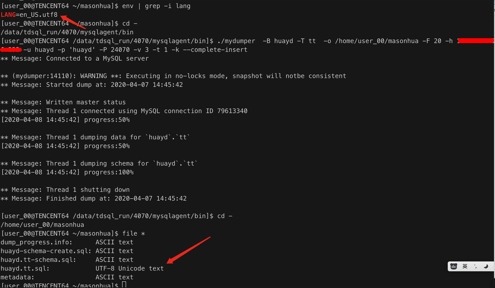
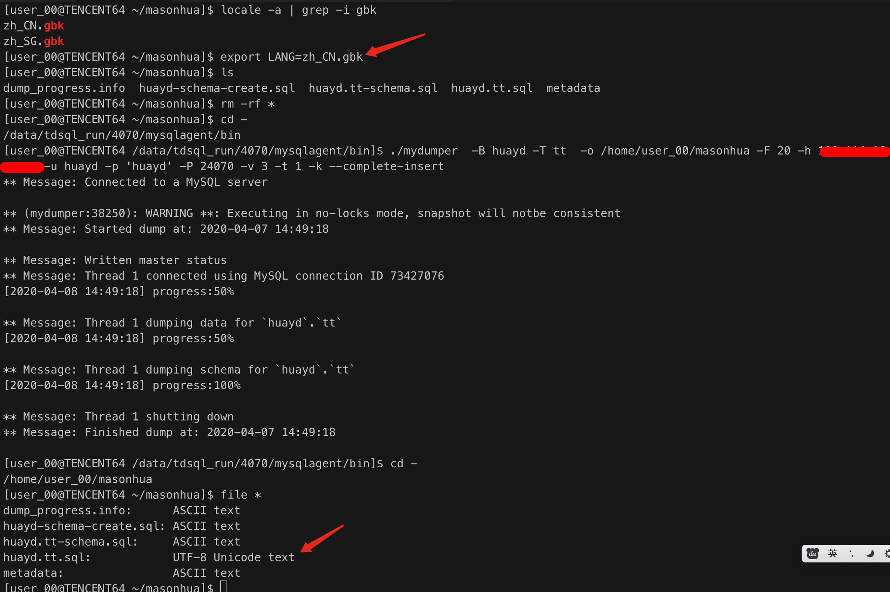
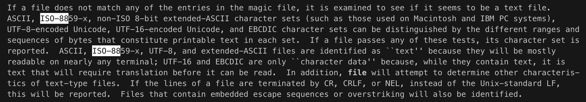

***测试mydumper的时候，发现mydumper导出的文件的编码各异，有点捉摸不定。***

**Centos 7.6, LANG=zh_CN.gbk使用mydumper导出文件后查看，文件的编码是iso-8859-1。**


**Centos 7.2/tlinux2-0041, LANG=en_US.utf8使用mydumper导出文件后查看，文件的编码是UTF-8 Unicode text。**



**Centos 7.2, LANG=zh_CN.gbk使用mydumper导出文件后查看，文件的编码是UTF-8 Unicode text。**


-------------------------

##### 查file命令的帮助文件发现，file并不能完全的辩识文件的字符集。



```
The `file` command makes "best-guesses" about the encoding. Use the `-i` parameter to force `file` to print information about the encoding.

The file command has no idea of "valid" or "invalid". It just sees some bytes and tries to guess what the encoding might be. As humans we might be able to recognize that a file is a text file with some umlauts in a "wrong" encoding. But as a computer it would need some sort of artificial intelligence.
```

可以使用uchardet来进行检测。

```
The huge advantage of `uchardet` is that it analyses the whole file (just tried with a 20GiB file) as opposed to `file` and `enca`
```
